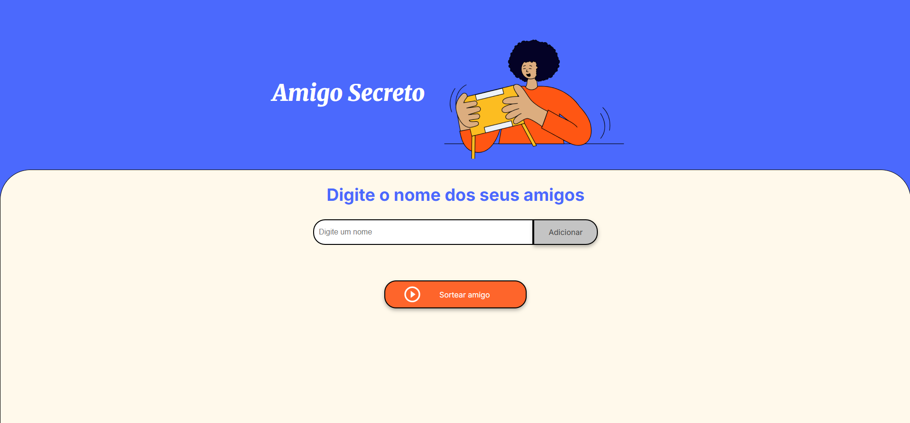
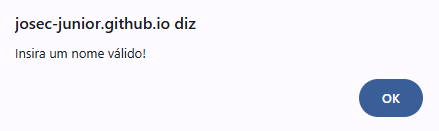
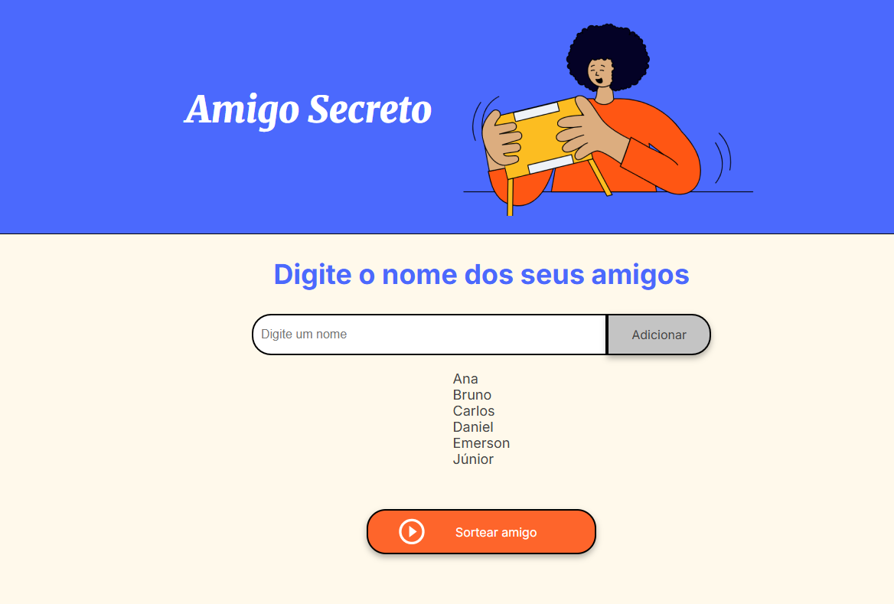
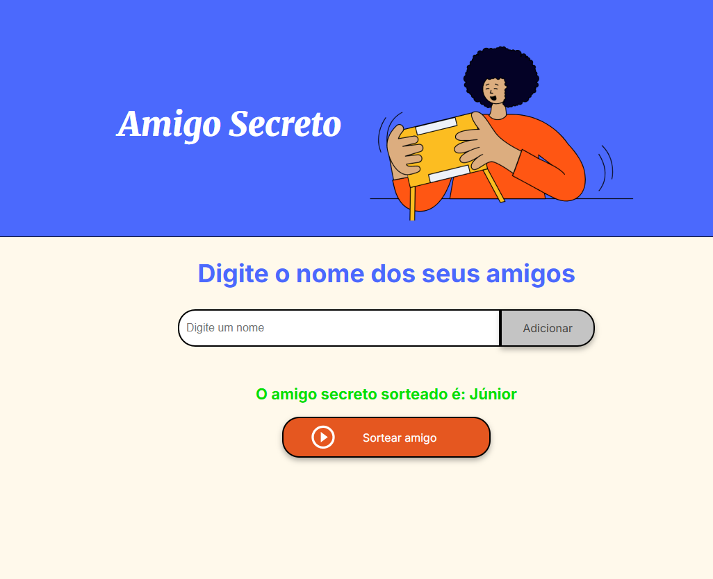
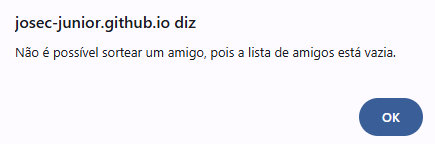

# Challenge Amigo Secreto

Este projeto consiste no desafio da trilha de **Iniciante em Programação** do programa ONE (*Oracle Next Education*) promovido pela **Oracle** em parceria com a **Alura**, e trata-se de uma aplicação web em que o usuário pode adicionar o nome de seus amigos e sorteá-los.

## ⚙️ Funcionalidades

- Adicionar os nomes de amigos;
- Visualização da lista de amigos adicionados;
- Sorteio de amigos feito de forma aleatória;
- Exibição do resultado do sorteio.

## 🛠️ Tecnologias Utilizadas

- HTML5 (*HyperText Markup Language*);
- CSS3 (*Cascading Style Sheets*);
- JavaScript;
- Git, GitHub & GitHub Pages.

## ▶️ Como Utilizar

Acesse a aplicação pelo seguinte link (https://josec-junior.github.io/ChallengeAmigoSecreto/) ou clicando [aqui](https://josec-junior.github.io/ChallengeAmigoSecreto/). Acessando ela, você será redirecionado para uma página como essa:

Caso o usuário tente adicionar um amigo sem ter digitado o nome, a aplicação irá exibir o seguinte `alert`:

Após digitado o nome do amigo e clicado no botão `Adicionar`, é exibido abaixo uma lista com os nomes dos amigos que foram adicionados:

Depois de ter digitado o nome de todos os amigos, ao clicar no botão `Sortear amigo`, um dos amigos da lista é sorteado aleatoriamente, como mostrado na imagem abaixo:

Caso o usuário tente sortear algum amigo sem ter adicionado nenhum nome, a aplicação irá exibir o seguinte `alert`:

## 🧑‍💻 Autor

[José Júnior](https://github.com/josec-junior)